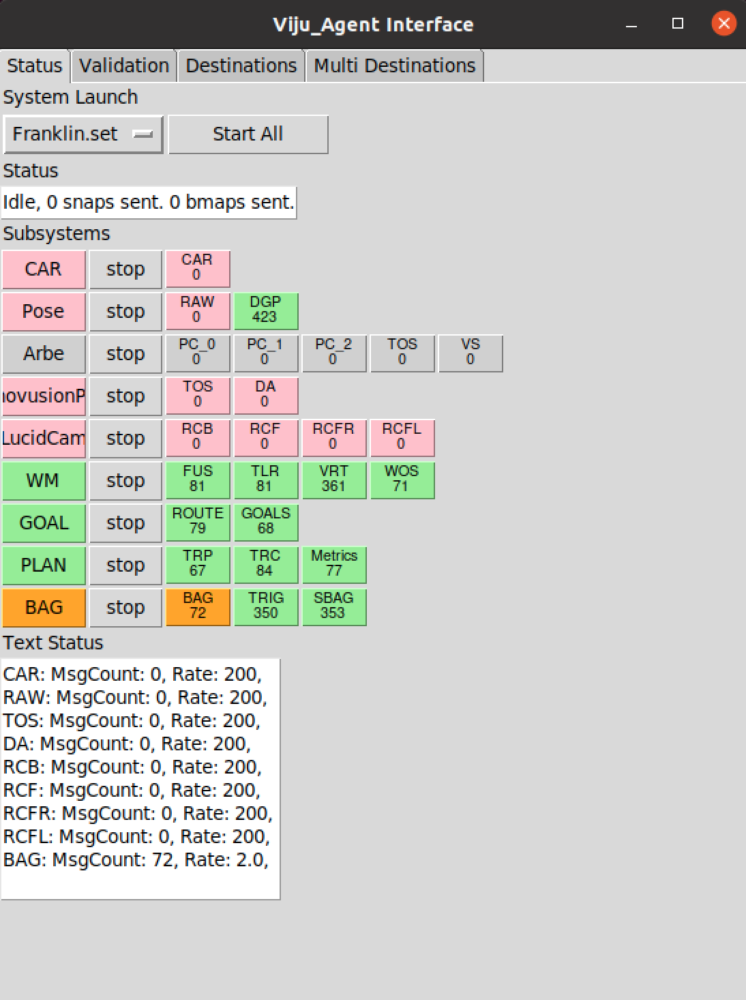
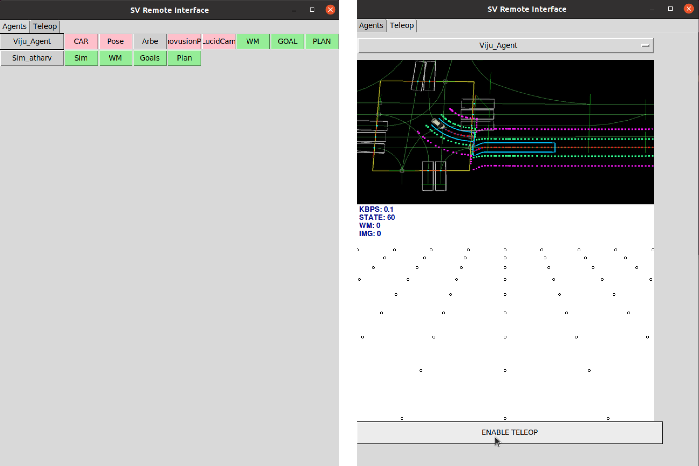

# NRC AV UI

This package provides the Autonomous Vehicle User Interface (AV UI) and control system. It includes two main UI applications:

`av_ui\av_ui.py` – Designed to run directly on the vehicle, providing local control and monitoring.

`av-ui\remoteMonitor.py` – Enables remote monitoring of the vehicle’s services and system status.

### Folder Structure

`av_ui`: Contains vehicle and remote monitoring UI apps.

`av_ui\msgs`: MQTT message definitions used for communicating between the Vehicle app and the remotMonitor app

`config`: YAML configuration files specifying the ROS services to be launched on the vehicle.

`launch`: Scripts for recording data using rosbag.

`src\nrc_snapshot_trigger`: Python module responsible for triggering snapshot recordings.

## av_ui.py

`av_ui.py` is the main control script for the autonomous vehicle system. It manages the communication between the vehicle and cloud services, handles real-time monitoring, and provides an optional graphical user interface for system interaction.

### Key Features

- GUI interface
- Real-time monitoring and status updates
- Cloud service communication
- Snapshot transmission system
- World model updates management
- ROS (Robot Operating System) integration

### Prerequisites

- Required Python packages:
  - rospy
  - numpy

### Usage

`python3 av_ui.py [-h] [-c CONFIG] [-a AGENT] [-v VERBOSE]`

#### Command Line Arguments

| Argument | Long Form | Description                  | Default Value |
|----------|-----------|------------------------------|---------------|
| `-c` | `--config` | Configuration file full path | From environment variable `AGENT_CONFIG` |
| `-a` | `--agent` | Agent name                   | From environment variable `AGENT_NAME` |
| `-v` | `--verbose` | Enable verbose mode          | False |

Note:- If AGENT_CONFIG is set, then it looks for that file under `config` folder

### Update Frequencies

The script maintains different update frequencies for various components:

- Monitor polling: Every 0.05 seconds
- Status updates: Every 1.0 seconds
- Snapshot transmission: Every 0.1 seconds (when conditions are met)

### Features

1. **Real-time Monitoring**
   - Continuous system status monitoring
   - Agent mail (coming from remote monitor) parsing
   - GUI updates (when enabled)

2. **Status Management**
   - Regular status CSV transmission to cloud
   - Connection status monitoring
   - Round-trip message time tracking

3. **World Model Updates**
   - Support for teleoperation mode
   - Configurable update rates
   - Conditional data transmission based on system state

4. **Snapshot System**
   - Automated snapshot transmission
   - Network condition-aware sending
   - Queue management to prevent overflow

5. **Safety Features**
   - Graceful shutdown handling (Ctrl+C)
   - Network connection monitoring
   - Automatic process cleanup

## remoteMonitor.py

The Remote Monitor script provides functionality for remote monitoring and control of the autonomous vehicle system through ROS (Robot Operating System). It uses MQTT messaging for communicating with the components running on the vehicle.

### Key Features

- GUI Interface
- Remote Vehicle System Monitoring
- Vehicle subsystem Status Management

### Usage

`python3 remoteMonitor.py [-h] [-b BROKER]`

#### Command Line Arguments

| Argument | Long Form   | Description                                                       | Default Value |
|----------|-------------|-------------------------------------------------------------------|---------------|
| `-b`     | `--broker`  | MQTT Broker name as defined in config\mqtt_connection_config.yaml | emqx |

### ROS Topics

The remote monitor subscribes to various ROS topics for system monitoring:

- Status topics for vehicle subsystems
- Sensor data streams
- Command and control channels
- System diagnostics

### Features

1. **Remote Vehicle System Monitoring**
   - Monitors vehicle status and parameters
   - Collects telemetry data
   - Processes system events and alerts

2. **Data Collection**
   - Gathers real-time sensor data
   - Monitors vehicle subsystem states
   - Tracks system performance metrics

3. **Communication**
   - Handles message passing between components
   - Processes incoming commands and requests

4. **Status Management**
   - Monitors connection health
   - Tracks system state changes
   - Reports system diagnostics